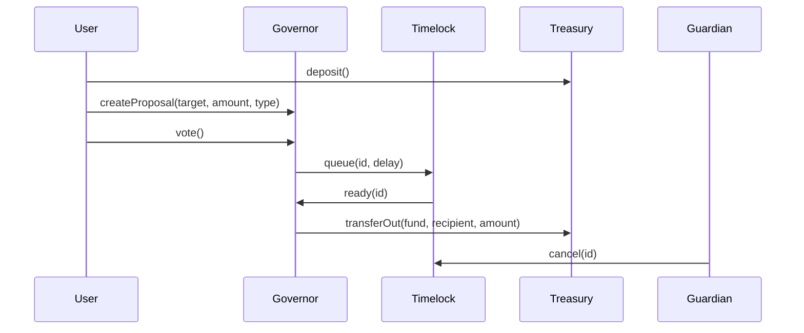

# ARCHITECTURE — CryptoVentures DAO

## Overview

CryptoVentures DAO governance system is modular and deliberately separated into small, auditable contracts. This document describes key components, data flows, and reasoning.

### Key components

- **CVStake** — Tracks ETH deposits and converts them to voting power using square-root scaling (anti-whale).
- **CVDelegationFixed** — Delegation mechanism; delegator assigns voting power to a delegate; revocable.
- **CVConfig** — Governance parameters per proposal type: quorum %, approval %, timelock seconds.
- **CVGovernorV2** — Core governance logic: proposal creation, voting, queuing, execution orchestration.
- **CVTimelock** — Enforces execution delays and supports cancellation.
- **CVTreasury** — Multi-tier fund buckets and secure withdrawal API for governance.
- **CVRoles** — Role registry (PROPOSER_ROLE, EXECUTOR_ROLE, GUARDIAN_ROLE).
- **Support libraries** — CVVotePower, CVQuorumLogic, CVProposalState, CVEvents, CVHistory, etc.

## Data model (Proposal)

A `Proposal` records:
- proposer (address)
- target (recipient address)
- amount (wei)
- pType (proposal type index)
- start/end (timestamps for voting window)
- forVotes / againstVotes
- flags: queued, executed, cancelled

## Proposal lifecycle

1. **Draft/Pending** — proposal created; start time may be immediate or scheduled.
2. **Active** — voting window open; voters (or delegates automatically) cast votes.
3. **Queued** — if quorum & approval thresholds pass, Governor queues proposal to Timelock.
4. **Queued → Executed** — after the configured timelock delay, Executor can execute; execution moves funds from Treasury.
5. **Defeated** — insufficient quorum or approval; no queueing.
6. **Cancelled** — Guardian can cancel a queued proposal during timelock window.

## Proposal types and policy (default in CVConfig)

- **0 — High-Conviction**: quorum 60%, approval 70%, timelock 3 days.
- **1 — Experimental**: quorum 40%, approval 60%, timelock 1 day.
- **2 — Operational**: quorum 20%, approval 50%, timelock 6 hours.

These values are configurable via CVConfig.set (governance-controlled in production).

## Voting power & delegation

- Voting power = sqrt(stake). This reduces whale dominance while preserving stake utility.
- Delegation is immediate: when a delegate votes, delegated voting power is included automatically.
- Each account may only vote once per proposal.

## Treasury & fund segregation

- Deposits go to `HighConviction` pool by default.
- Governance can `allocate` funds from HighConviction into Experimental or Operational pools.
- `transferOut` only callable by Governor (via GOVERNANCE_ROLE) and enforced by timelock + role separation.

## Role responsibilities

- **Proposer**: create proposals (restricted to addresses with minimum stake and PROPOSER_ROLE)
- **Executor**: queue and execute proposals (EXECUTOR_ROLE)
- **Guardian**: cancel queued proposals during timelock (GUARDIAN_ROLE)
- **Admin**: initial deployer — grants roles to addresses/contracts

## Interaction diagrams

Use Mermaid or any diagram editor to create visuals. Example mermaid snippet:

## Contract upgrade & audits

- Contracts are modular to ease auditing: small contracts with single responsibility (config, timelock, treasury, stake).
- To upgrade logic in production, a governance-controlled upgrade path (proxy pattern) should be used; this project uses simple contracts for assessment.

## Testing & verification

- Unit tests cover: stake/deposit, delegation, voting, quorum/approval, timelock enforcement, treasury operations, guardian cancellation, edge cases (zero-vote, ties, insufficient funds).

---

## Deployment checklist 

1. `npm ci`  
2. `npx hardhat node`  
3. `npx hardhat run scripts/deploy.ts --network localhost`  
4. `npx hardhat run scripts/seed.ts --network localhost`  
5. `npx hardhat test`

---

## Notes for integrators

- Replace `.env.example` placeholders with real RPC and private key for deployment to testnet/mainnet.
- Ensure `CVConfig` parameters are tuned via governance proposals before allocating large capital.
- Consider adding timelock governance for CVConfig.set to make parameter changes slow and auditable.
