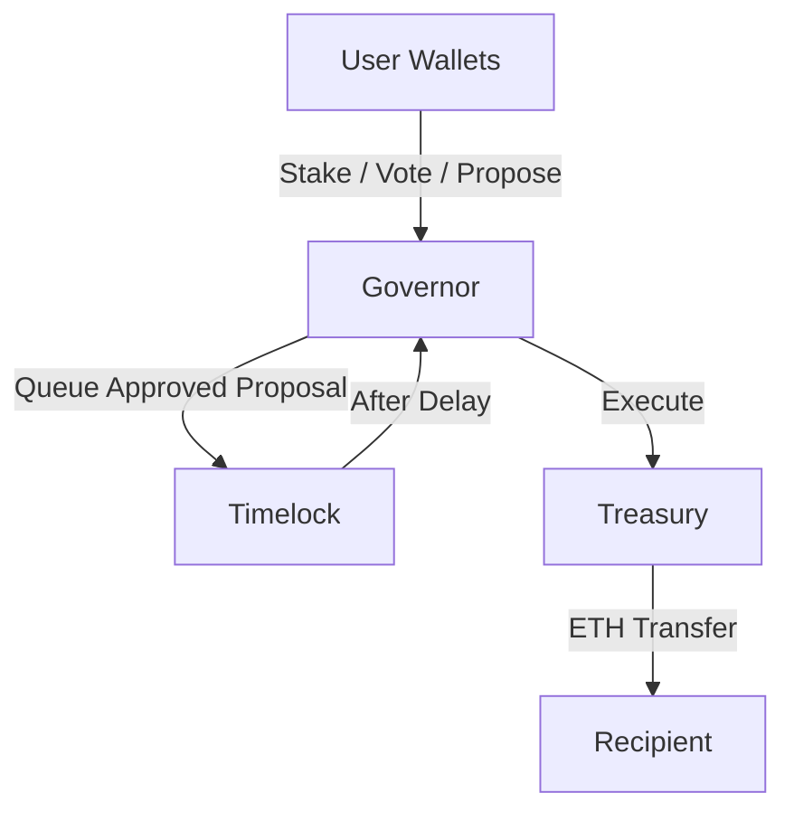
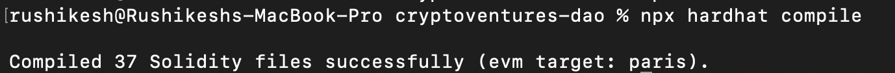
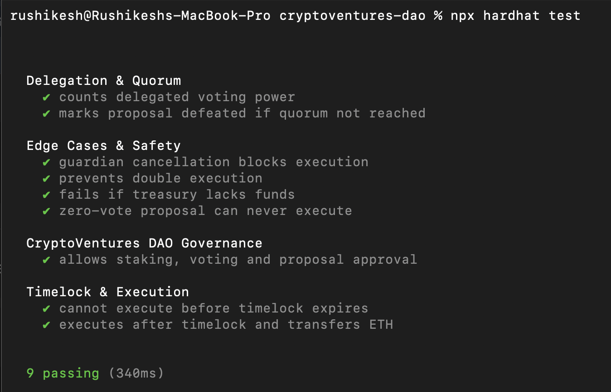
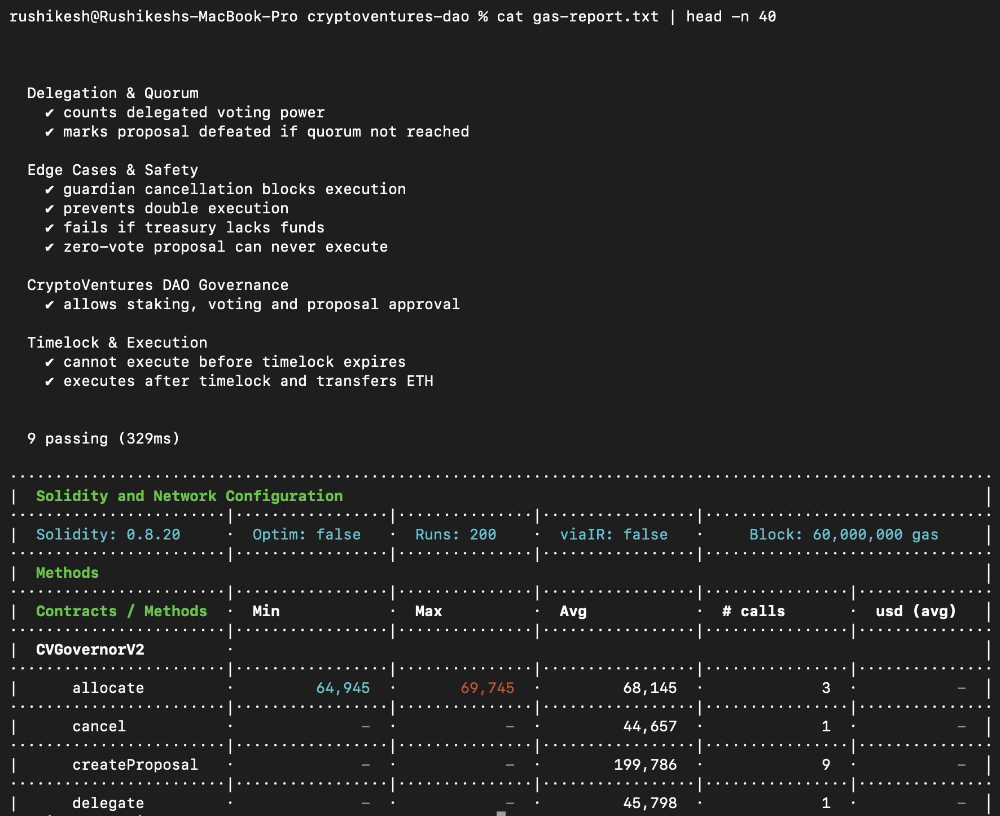
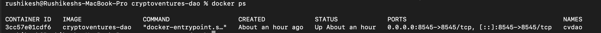

# CryptoVentures DAO Governance

CryptoVentures DAO is a decentralized investment protocol that allows ETH holders to collectively manage a shared treasury through on‑chain governance.  
Members stake ETH to gain voting power, propose investments, vote, delegate votes, and securely execute approved proposals through a timelocked treasury.

This system is inspired by production governance models used by protocols like Compound, Aave, and MakerDAO.

---

## Governance Architecture

The DAO is built around four core components:

- **Users (DAO Members)** – Stake ETH, vote, delegate, and create proposals  
- **CVGovernorV2** – Manages proposals, voting, quorum, approval logic  
- **CVTimelock** – Enforces execution delays for security  
- **CVTreasury** – Holds and releases DAO funds  

### Flow of Control



---

## Proposal Lifecycle

Every proposal follows a strict state machine:

```
Pending → Active → Queued → Executed
                  ↘
                   Defeated
```

- **Pending** – Created but voting not started  
- **Active** – Voting open  
- **Queued** – Approved, waiting in timelock  
- **Executed** – Funds released  
- **Defeated** – Failed quorum or approval  

---

## Roles

| Role | Purpose |
|------|--------|
| Proposer | Can create proposals |
| Executor | Can queue & execute proposals |
| Guardian | Can cancel malicious proposals |

Roles are enforced on‑chain via `CVRoles`.

---

## Setup Instructions

### 1️⃣ Install Dependencies

```bash
git clone https://github.com/Rushikesh-5706/cryptoventures-dao.git
cd cryptoventures-dao
npm install
```

---

### 2️⃣ Configure Environment

Copy the example environment:

```bash
cp .env.example .env
```

`.env.example` already contains everything required for local execution.

---

### 3️⃣ Start Local Blockchain

```bash
npx hardhat node
```

---

### 4️⃣ Deploy the DAO

In a new terminal:

```bash
npx hardhat run scripts/deploy.ts --network localhost
```

This deploys:
- CVRoles
- CVTreasury
- CVConfig
- CVTimelock
- CVGovernorV2

---

### 5️⃣ Seed Test Data

```bash
npx hardhat run scripts/seed.ts --network localhost
```

This creates:
- Multiple DAO members
- Stakes
- Sample proposals
- Votes & delegations

---

### 6️⃣ Run the Test Suite

```bash
npx hardhat test
```

All governance, quorum, delegation, timelock, and treasury tests must pass.

---

## Verification Screenshots

### Compile


This shows all Solidity contracts compiling successfully.

---

### Tests


All governance, delegation, timelock, and edge‑case tests passing.

---

### Gas Report


Gas usage for key DAO functions such as proposal creation, voting, and execution.

---

### Docker


DAO running inside a Docker container exposing the Hardhat RPC.

---

## Usage Examples

### Deposit ETH

```solidity
await governor.deposit({ value: ethers.parseEther("10") });
```

---

### Create Proposal

```solidity
await governor.createProposal(
  recipient,
  ethers.parseEther("1"),
  0  // High‑conviction fund
);
```

---

### Vote

```solidity
await governor.vote(1, true);
```

---

### Delegate Voting Power

```solidity
await governor.delegate(alice.address);
```

---

### Queue & Execute

```solidity
await governor.queue(1);
await time.increase(3 * 24 * 3600);
await governor.execute(1);
```

---

## Design Decisions

- **Quadratic voting** reduces whale dominance  
- **Delegation** enables passive members to participate  
- **Timelock** protects against governance attacks  
- **Multi‑fund treasury** separates risk tiers  

---

## Docker

The DAO runs inside a reproducible Docker container exposing port `8545` for RPC access.

---

## Demo

A full walkthrough video demonstrates:
- Deposits
- Proposals
- Voting
- Delegation
- Timelock execution
