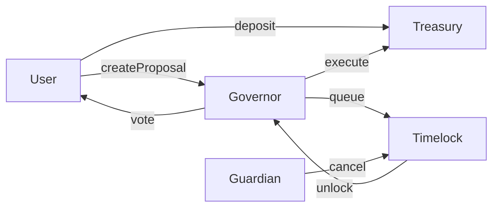

# CryptoVentures DAO — Governance System

## Project Overview

CryptoVentures DAO is a decentralized investment fund that lets token holders collectively manage a multi-tier treasury and make investment decisions. This repository implements a production-grade governance system with:

- Stake-based governance influence (anti-whale square-root scaling)
- Delegation (revocable) and on-chain vote inclusion
- Proposal lifecycle: Pending → Active → Queued → Executed / Defeated
- Configurable proposal types (High‑conviction, Experimental, Operational) with bespoke quorum, approval, and timelock settings
- Timelock queue with guardian cancellation and role-based execution
- Multi-tier treasury (HighConviction, Experimental, Operational) with allocation and protected withdrawals
- Complete test suite covering typical flows and edge cases

This README explains how to run, test, and interact with the system, along with design decisions and examples expected by evaluators.

---

## Quick repo layout

```
contracts/
  access/
    CVRoles.sol
  governance/
    CVConfig.sol
    CVDelegationFixed.sol
    CVGovernorV2.sol
    CVHistory.sol
    CVProposalCore.sol
    CVProposalState.sol
    CVQuorumLogic.sol
    CVStake.sol
    CVTimelock.sol
    CVVotePower.sol
    ... (other modular files)
  treasury/
    CVTreasury.sol
scripts/
  deploy.ts
  seed.ts
  phase2_check.ts
test/
  delegation.test.js
  edgecases.test.js
  governance.test.js
  timelock.test.js
hardhat.config.js
.env.example
Dockerfile
screenshots/
  1_compile.png
  2_tests.png
  3_gas.png
  4_docker.png
gas-report.txt
```

---

## Prerequisites

- Node.js (recommended v18.x or v20.x; Hardhat warns on v24)
- npm
- Docker (for building the container image)
- Git

---

## Local development: step-by-step

All steps are terminal commands. Replace `<...>` values where appropriate.

1. Clone and install:

```bash
git clone https://github.com/Rushikesh-5706/cryptoventures-dao.git
cd cryptoventures-dao
npm ci
# Ensure package.json has "type": "module" (Hardhat ESM requirement)
npm pkg set type="module"
```

2. Configure environment:

```bash
cp .env.example .env
# .env.example provides sane defaults:
# RPC_URL=http://127.0.0.1:8545
# DEPLOYER_PRIVATE_KEY=0xaaaaaaaaaaaaaaaaaaaaaaaaaaaaaaaaaaaaaaaaaaaaaaaaaaaaaaaaaaaaaaaa
```

3. Start a local chain and deploy (in separate terminals):

Terminal A — Hardhat node:
```bash
npx hardhat node
```

Terminal B — Deploy & seed:
```bash
npx hardhat run scripts/deploy.ts --network localhost
npx hardhat run scripts/seed.ts --network localhost
```

4. Run the test suite:

```bash
npx hardhat test
```

**Expected**: `9 passing` (or the full test count reported in the test files). Tests cover staking, delegation, proposal lifecycle, timelock behavior, edge cases and treasury safety.

---

## Usage examples — common workflows

All examples assume you have deployed contracts locally (see `scripts/deploy.ts`) and use `ethers` in scripts or Hardhat console.

### 1) Deposit (gain stake / voting power)

```js
// example using ethers
await signer.sendTransaction({ to: Treasury.address, value: ethers.parseEther("1") });
```

This increases the caller's stake (and square-root scaled voting power).

### 2) Create a proposal (proposer role required)

```js
await Governor.connect(proposer).createProposal(targetAddress, ethers.parseEther("0.5"), 0); // pType 0 = high-conviction
```

### 3) Vote (within voting window)

```js
await Governor.connect(voter).vote(proposalId, true); // true = for
```

### 4) Delegation (revocable)

```js
await Delegation.connect(delegator).delegate(delegateAddress);
```

Delegated voting power is automatically counted when the delegate votes (no extra action from delegator).

### 5) Queue & Execute (after voting success + timelock)

```js
await Governor.connect(executor).queue(proposalId);
# wait timelock period
await Governor.connect(executor).execute(proposalId);
```

Guardian cancellation:

```js
await Guardian.connect(guardian).cancel(proposalId);
```

If cancelled, execution will fail.

---

## Scripts

- `scripts/deploy.ts` — Deploys all contracts and sets roles.
- `scripts/seed.ts` — Seeds the network with test deposits, sample proposals and role grants used by tests/demo.

Run with:
```bash
npx hardhat run scripts/deploy.ts --network localhost
```

---

## Docker

Build locally:

```bash
docker build -t cryptoventures-dao .
```

Run container mapping local port 8545:
```bash
docker run -p 8545:8545 --name cvdao cryptoventures-dao
```

Push (example to Docker Hub; authenticate first):

```bash
docker login
docker tag cryptoventures-dao rushi5706/cryptoventures-dao:latest
docker push rushi5706/cryptoventures-dao:latest
```

**Note:** Docker push may fail due to network/registry issues; retry and verify auth.

---

## Design decisions & trade-offs (short)

1. **Square-root scaling of voting power** — chosen to reduce whale dominance while keeping stake meaningful. Trade-off: small stakeholders have relatively more influence than linear scale, which is intentional for fairness.

2. **Multi-tier treasury** — separates high-conviction capital (slow, more approvals) from operational funds (fast, fewer approvals). Trade-off: complexity in bookkeeping vs safer financial controls.

3. **Timelock + guardian** — a timelock protects against immediate fund drains; the guardian can cancel malicious queued proposals, at the cost of introducing a centralized emergency role (accepted in practice for security during early stages).

4. **Role-based access (Proposer / Executor / Guardian)** — separates duties to reduce privilege concentration. Trade-off: additional on-chain role management complexity.

---

## Architecture diagrams & screenshots

- The repo includes `screenshots/1_compile.png`, `2_tests.png`, `3_gas.png`, `4_docker.png`.
- For the architecture diagram, evaluators expect:
  - Proposal lifecycle flow (Pending → Active → Queued → Executed/Defeated)
  - Interactions between: User wallets → Governor → Timelock → Treasury
  - Role responsibilities (Proposer, Executor, Guardian)

A recommended mermaid snippet (paste into Mermaid live editor or supported renderer):



---

## Tests & expected behaviour

- Staking increases voting power (sqrt)
- Delegation transfers voting power to delegate
- Votes can only be cast during voting window
- Quorum & approval thresholds are per proposal type
- Timelock prevents early execution
- Guardian cancel prevents execution
- Treasury allocation & transfer checks for insufficient funds

---

## What evaluators will run (recommended checklist to include in README)

1. `npm ci`
2. `npx hardhat node`
3. `npx hardhat run scripts/deploy.ts --network localhost`
4. `npx hardhat run scripts/seed.ts --network localhost`
5. `npx hardhat test`
6. Inspect screenshots and gas-report

---

## Contact / Notes

This repository was prepared for an assessment. If an evaluator needs clarification, point them to `ARCHITECTURE.md` and `SECURITY.md` for detailed explanations.

